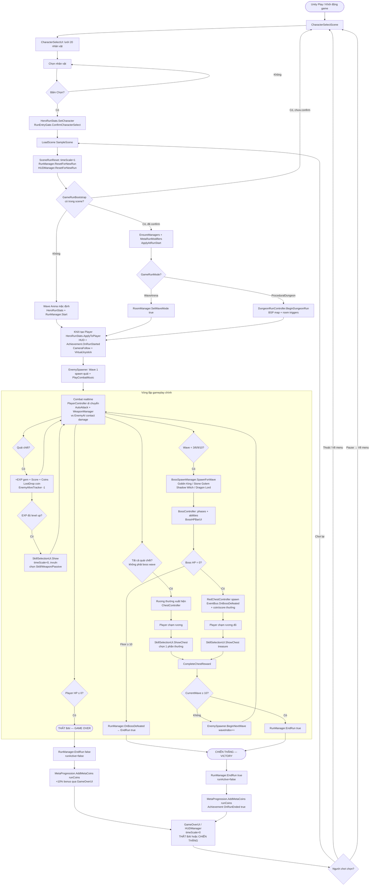
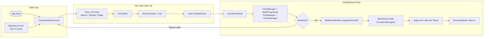
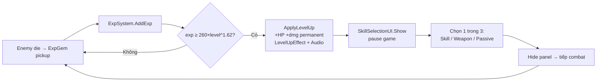
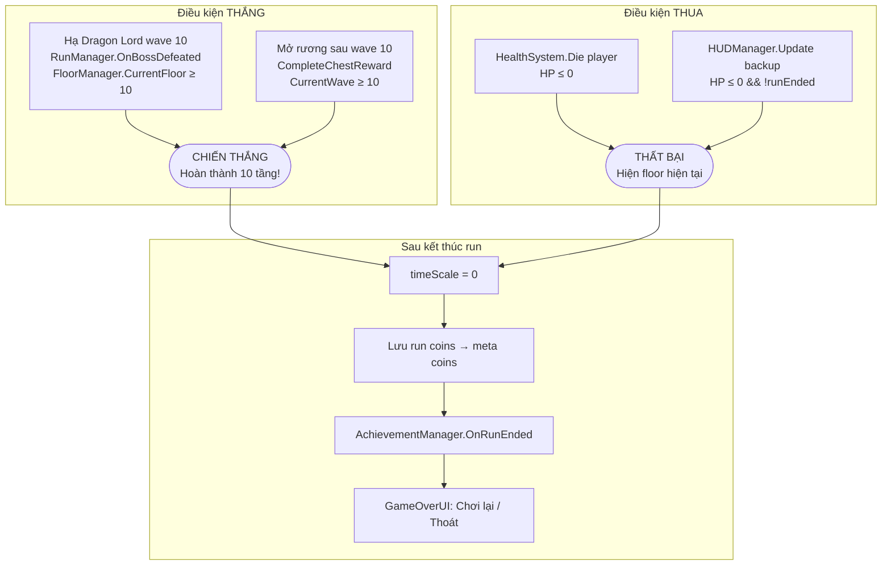
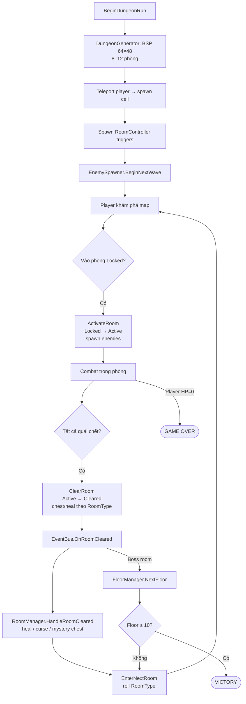
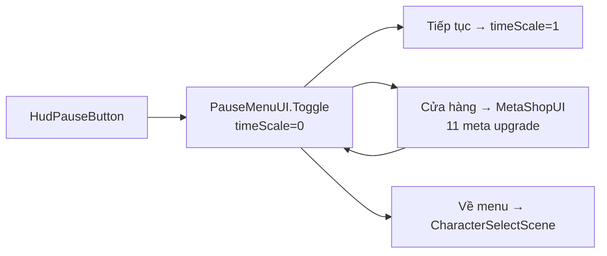

# DungeonSoul — Sơ đồ luồng Gameplay

Tài liệu mô tả luồng chơi từ lúc khởi động đến thắng/thua, dựa trên code trong `Assets/Scripts/`.

## Scene & điểm vào

| Build Index | Scene | Vai trò |
|-------------|-------|---------|
| 0 | `CharacterSelectScene` | Scene khởi động mặc định |
| 1 | `SampleScene` | Gameplay chính (Wave Arena / Dungeon) |

---

## Sơ đồ tổng quan — Start → Win / Lose

---

## Luồng khởi tạo chi tiết

---

## Vòng combat & tiến trình Wave

```mermaid
flowchart TD
    subgraph COMBAT_SYS["Hệ thống combat"]
        P1[PlayerController<br/>keyboard + VirtualJoystick] --> P2[AutoAttack: melee/projectile]
        P2 --> P3[WeaponManager: tối đa 6 slot auto-fire]
        P3 --> DMG[HealthSystem.TakeDamage]
        E1[EnemyAI: chase player] --> E2[contact damage → Player HP]
        E2 --> DMG
        DMG --> DIE{HP ≤ 0?}
    end

    subgraph ENEMY_DIE["Khi quái chết"]
        DIE -->|Enemy| ED1[ExpGem spawn]
        ED1 --> ED2[RunManager score/coins]
        ED2 --> ED3[BossController.OnBossDefeated nếu boss]
        ED3 --> ED4[EnemyAliveTracker.Add -1]
    end

    subgraph WAVE_PROG["Tiến trình Wave 1→10"]
        W1[Wave 1: 8–13+ quái] --> W2[Clear → Rương thường]
        W2 --> W3[Chọn skill → BeginNextWave]
        W3 --> W4{Wave index}
        W4 -->|1,2,4,5,7,8| W1
        W4 -->|3| B1[BOSS: Goblin King]
        W4 -->|6| B2[BOSS: Stone Golem]
        W4 -->|9| B3[BOSS: Shadow Witch]
        W4 -->|10| B4[BOSS: Dragon Lord]
        B1 & B2 & B3 & B4 --> BR[Red chest → skill → next wave hoặc WIN]
    end

    DIE -->|Player| GO[EndRun false → GAME OVER]
    BR -->|Wave 10 cleared| WIN([VICTORY])
    B4 -->|Boss defeated + Floor≥10| WIN
```

---

## Luồng Level Up (song song combat)

---

## Điều kiện Thắng / Thua

---

## Luồng Dungeon Mode (ProceduralDungeon — tùy chọn)

Kích hoạt khi `GameRunBootstrap.runMode = ProceduralDungeon`.

### Loại phòng (Dungeon mode)

| RoomType | Hiệu ứng |
|----------|----------|
| Normal / Elite | Combat + rương |
| Treasure | Rương skill |
| Healing | Hồi 35% HP |
| Shop | MetaShopUI |
| Forge | SkillSelectionUI reroll |
| Curse | -10% max HP |
| Mystery | 50% bonus chest |
| Challenge | Combat khó |
| Boss | NextFloor khi clear |

---

## Luồng Pause & Meta (ngoài combat)

---

## Class / file tham chiếu chính

| Giai đoạn | File |
|-----------|------|
| Chọn nhân vật | `CharacterSelectUI.cs`, `RunEntryGate.cs` |
| Bootstrap | `GameRunBootstrap.cs`, `SceneRunReset.cs` |
| Run state | `RunManager.cs`, `FloorManager.cs`, `HeroRunStats.cs` |
| Combat | `PlayerController.cs`, `AutoAttack.cs`, `WeaponManager.cs`, `EnemyAI.cs`, `HealthSystem.cs` |
| Wave | `EnemySpawner.cs`, `EnemyAliveTracker.cs` |
| Boss | `BossSpawnManager.cs`, `BossController.cs` |
| Phần thưởng | `ChestController.cs`, `RedChestController.cs`, `SkillSelectionUI.cs`, `ExpSystem.cs` |
| Dungeon | `DungeonRunController.cs`, `RoomController.cs`, `RoomManager.cs` |
| Kết thúc | `HUDManager.cs`, `GameOverUI.cs`, `MetaProgression.cs` |

---

## Tóm tắt

1. **Vào game:** `CharacterSelectScene` → chọn hero → `SampleScene`.
2. **Chơi:** Survive 10 wave; diệt quái, lên level, chọn skill từ level-up và rương.
3. **Boss:** Wave 3, 6, 9, 10 — mỗi boss có phase; thưởng rương đỏ.
4. **Thắng:** Hạ boss tầng 10 **hoặc** hoàn tất chọn skill từ rương sau wave 10.
5. **Thua:** HP player về 0.
6. **Sau run:** Xu run chuyển meta xu; Chơi lại hoặc về màn chọn nhân vật.
