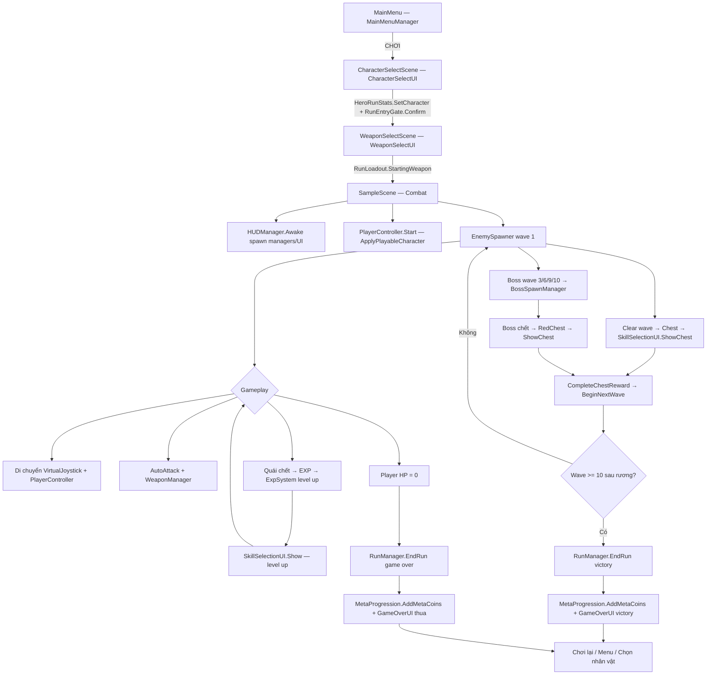

# DUNGEON SOUL — LUỒNG XỬ LÝ CODEBASE

**Phiên bản:** 1.0  
**Ngày:** 08/06/2026  
**Mục đích:** Bản đồ luồng Play → Kết thúc; phân loại code **đang dùng** vs **có nhưng không/chưa dùng**

---

## 1. Luồng chính: Play → Kết thúc (đang dùng)

**Build order scene:** `MainMenu` → `CharacterSelectScene` → `WeaponSelectScene` → `SampleScene`



### Chi tiết từng bước

| Bước | File chính | Việc xảy ra |
|------|------------|-------------|
| **1. Menu** | `Assets/Scripts/UI/MainMenuManager.cs` | Dựng UI runtime → `LoadScene("CharacterSelectScene")` |
| **2. Chọn nhân vật** | `Assets/Scripts/UI/CharacterSelectUI.cs` | 20 entry từ `PlayableCharacterCatalog` → lưu `PlayerPrefs` → `RunEntryGate.ConfirmCharacterSelect()` |
| **3. Chọn vũ khí** | `Assets/Scripts/UI/WeaponSelectUI.cs` | 5 vũ khí → `RunLoadout.StartingWeapon` → `LoadScene("SampleScene")` |
| **4. Vào game** | `Assets/Scripts/Managers/SceneRunReset.cs` | Reset coin/score, `Time.timeScale = 1` |
| **4b. Bootstrap UI** | `Assets/Scripts/UI/HUDManager.cs` | Tự spawn: `HeroRunStats`, `MetaShopManager`, `BossSpawnManager`, `VirtualJoystick`, `PauseMenuUI`, `MetaShopUI`, `AudioManager`… |
| **5. Nhân vật** | `Assets/Scripts/Player/PlayerController.cs` | `PlayableCharacterCatalog.GetSelected()` → `ApplyPlayableCharacter()` → `SimpleSpriteAnimator` |
| **5b. Stats** | `Assets/Scripts/Managers/HeroRunStats.cs` | Gắn HP/damage/move theo entry hoặc class |
| **6. Wave** | `Assets/Scripts/Enemy/EnemySpawner.cs` | Wave 1 spawn quái (`EnemyArchetypeUtility`) |
| **7. Combat** | `AutoAttack`, `WeaponManager`, `Projectile` | Auto bắn/đánh, evolve vũ khí |
| **8. EXP** | `Assets/Scripts/Player/ExpSystem.cs` | Level up → `SkillSelectionUI.Show()` (3 lựa chọn) |
| **9. Clear wave** | `EnemySpawner` + `ChestController` | Hết quái → rương → `ShowChest()` → chọn skill → `BeginNextWave()` |
| **10. Boss** | `BossSpawnManager`, `BossController` | Wave **3, 6, 9, 10** → boss → chết → `RedChestController` → skill → wave tiếp |
| **11. Thắng** | `SkillSelectionUI.CompleteChestReward()` | Sau rương wave ≥ 10 → `RunManager.EndRun(true)` |
| **12. Thua** | `HealthSystem.cs` | Player chết → `EndRun(false)` |
| **13. Kết thúc run** | `RunManager.cs` | `MetaProgression.AddMetaCoins(runCoins)` → `HUDManager.ShowRunResult` / `GameOverUI` |
| **14. Sau game** | `GameOverUI`, `PauseMenuUI` | Chơi lại (reload scene), về Menu, về Character Select |

**Chế độ đang chạy:** **Wave Arena** — wave tăng dần, HUD floor ≈ wave index (`EnemySpawner` gán `FloorManager.currentFloor`).

---

## 2. Component trên SampleScene (đang gắn scene)

| Component | Vai trò |
|-----------|---------|
| `EnemySpawner` | Spawn wave, rương sau clear |
| `KenneyStyleMapPainter` | Vẽ map tile |
| `CameraFollow` | Camera theo player |
| `GameplayPresentation` | Scale player/enemy/boss |
| `HUDManager` | HUD + spawn nhiều manager/UI runtime |
| `ChestController` | Rương sau wave thường |
| `FloorManager` | Số tầng (đồng bộ wave) |
| `MetaProgression` | Meta coin vĩnh viễn |
| `RunManager` | Coin/score run, EndRun |
| `GameManager` | Singleton rỗng (không logic) |
| `SkillSelectionUI` | Panel chọn skill |
| `PlayerController` | Di chuyển, visual nhân vật |
| `AutoAttack` | Tự đánh |
| `HealthSystem` | HP player |
| `PlayerSkillHandler` | Skill đang có |
| `ExpSystem` | EXP / level |
| `PlayerSkillStats` | Stat skill |
| `SkillBehaviors` | Logic skill đặc biệt |
| `PassiveItemManager` | **Có object, list rỗng** |
| `WeaponManager` | Vũ khí runtime |
| `SimpleSpriteAnimator` | Anim body |
| `GameOverUI` | Màn kết quả |

---

## 3. Có code + đang dùng (scene hoặc spawn runtime)

| Hệ thống | File | Trạng thái |
|----------|------|------------|
| Spawn quái / wave | `EnemySpawner.cs` | ✅ Scene |
| Boss theo wave | `BossSpawnManager.cs`, `BossController.cs` | ✅ HUD spawn |
| Skill cards | `SkillSelectionUI`, `PlayerSkillHandler`, `SkillBehaviors` | ✅ Scene |
| EXP / level | `ExpSystem.cs` | ✅ Trên Player |
| Vũ khí + evolve | `WeaponManager.cs` | ✅ Trên Player |
| HUD | `HUDManager.cs` | ✅ Scene + spawn UI |
| Meta coin (run) | `RunManager.cs` | ✅ Scene |
| Meta coin (vĩnh viễn) | `MetaProgression.cs` | ✅ Scene |
| Meta shop | `MetaShopManager`, `MetaShopUI` | ✅ HUD spawn |
| Nhân vật DB | `PlayableCharacterCatalog`, `Resources/PlayableCharacters/Database.asset` | ✅ Resources |
| Loadout vũ khí | `RunLoadout.cs` | ✅ PlayerPrefs |
| Pause / Joystick | `PauseMenuUI`, `VirtualJoystick` | ✅ HUD spawn |
| Game Over | `GameOverUI.cs` | ✅ Scene |
| Map tile | `KenneyStyleMapPainter.cs` | ✅ Scene |
| Presentation scale | `GameplayPresentation.cs` | ✅ Scene |
| Achievement (một phần) | `AchievementManager.cs` | ✅ HUD spawn |
| Audio | `AudioManager.cs` | ✅ HUD spawn |
| Event bus | `EventBus.cs` | ✅ Boss / room events |
| Bridge boss clear | `RoomClearBridge.cs` | ⚠️ Chỉ khi `GameRunBootstrap` chạy |

### HUDManager spawn khi Awake (`EnsureGameplayUiSystems`)

- `PauseMenuUI`
- `MetaShopUI`
- `AudioManager`
- `HeroRunStats`
- `AchievementManager`
- `MetaShopManager`
- `BossSpawnManager`
- `ObjectPooler`
- `BossHPBarUI`
- `VirtualJoystick`
- `HudPauseButton` (trên HUD)

---

## 4. Có code nhưng KHÔNG / HẦU NHƯ KHÔNG dùng

### 4.1 Không có trong scene & không được HUD spawn

| Hệ thống | File | Vì sao không chạy |
|----------|------|-------------------|
| **GameRunBootstrap** | `GameRunBootstrap.cs` | Không gắn scene; chỉ editor `GameSetupWizard` — phần lớn việc do `HUDManager` làm thay |
| **RoomManager** (Elite/Shop/Heal/Forge…) | `RoomManager.cs` | Không có object trong `SampleScene`; wave mode không gọi `EnterNextRoom()` |
| **Procedural Dungeon (BSP)** | `DungeonGenerator`, `DungeonRunController`, `RoomController`, `MinimapManager` | Chỉ khi `runMode = ProceduralDungeon` — không có trong scene |
| **BossRoom** (khóa cửa boss) | `BossRoom.cs` | Cho dungeon mode |
| **GameManager logic** | `GameManager.cs` | Chỉ `DontDestroyOnLoad`, không gameplay |

### 4.2 Có trong scene nhưng không có hiệu lực

| Hệ thống | Vấn đề |
|----------|--------|
| **PassiveItemManager** | `availableItems: []` trong scene → không ra passive trong skill pick |
| **MetaProgression Vital/Power** | Code cũ; shop mới dùng `MetaShopManager` |
| **5 skill placeholder** | Boomerang, LightningChain, PoisonCloud, BladeStorm, MirrorImage — asset có, logic combat yếu/không |
| **EnemyAnimationDatabase** | Builder 30+ set; runtime chỉ ~3 set trong Resources — quái còn lại fallback sprite tĩnh |
| **RoomData.trapEnabled** | Field only, không có trap |
| **FloorManager.NextFloor()** | Chỉ tăng số + HUD; không regen map |

### 4.3 Có code, chỉ dùng nhánh phụ / fallback

| Hệ thống | Khi nào chạy |
|----------|--------------|
| `HeroKnightLibrary` / `CharacterArtLibrary` | Fallback nếu không có `PlayableCharacterEntry` |
| `BuildChoices()` skill + weapon + passive | Chỉ **level-up** (`Show()`); passive pool thường rỗng |
| `ShowChest()` | Rương wave / boss — **chỉ skill**, không weapon |
| `RunEntryGate` redirect | Chỉ khi có `GameRunBootstrap` — play thẳng `SampleScene` thì bỏ qua gate |
| `RoomManager` heal/shop/curse | Chỉ nếu có instance + dungeon mode (`waveMode = false`) |

### 4.4 Scene prep — chỉ khi đi đúng flow menu

| Scene | Component | Ghi chú |
|-------|-----------|---------|
| `MainMenu` | `MainMenuManager` | UI runtime |
| `CharacterSelectScene` | `CharacterSelectUI` | UI runtime |
| `WeaponSelectScene` | `WeaponSelectUI` | UI runtime |
| Bỏ qua cả 3, vào thẳng `SampleScene` | — | Vẫn chơi được; weapon/character = PlayerPrefs mặc định |

---

## 5. Hai nhánh SkillSelectionUI (dễ nhầm)

| Trigger | API | Pool lựa chọn |
|---------|-----|----------------|
| **Level up** | `SkillSelectionUI.Show()` | 1 skill + 2 weapon + passive (passive thường trống) |
| **Rương / Boss chest** | `ShowChest()` | Chỉ skill (weighted rarity) |
| **Forge room** | `RoomManager` → `Show()` | ❌ RoomManager không active trong wave mode |

---

## 6. Điều kiện thắng / thua

| Kết quả | Đường kích hoạt |
|---------|-----------------|
| **Thua** | `HealthSystem` player → `RunManager.EndRun(false)` |
| **Thắng** | `CompleteChestReward()` khi `EnemySpawner.CurrentWave >= 10` sau khi chọn rương |
| **Thắng (dự phòng)** | `RunManager.OnBossDefeated()` nếu `FloorManager.CurrentFloor >= 10` khi boss chết |

### Chuỗi sau EndRun

```
RunManager.EndRun(victory)
  → MetaProgression.AddMetaCoins(runCoins)  [lần đầu end]
  → HUDManager.ShowRunResult / GameOverUI.Show
  → Time.timeScale = 1 (khi đóng skill panel)
```

---

## 7. Boss & wave

| Wave | Nội dung |
|------|----------|
| 1, 2, 4, 5, 7, 8 | Quái thường (8–24 con, scale theo wave) |
| **3** | Boss: Goblin King |
| **6** | Boss: Stone Golem |
| **9** | Boss: Shadow Witch |
| **10** | Boss: Dragon Lord → thắng sau rương skill |

`BossSpawnManager.IsBossWave(wave)` → `wave == 3 || 6 || 9 || 10`

---

## 8. GameRunBootstrap vs HUDManager (trùng lặp)

| Việc | GameRunBootstrap | HUDManager |
|------|------------------|------------|
| Spawn RunManager | ✅ Ensure | — (có sẵn scene) |
| Spawn HeroRunStats | ✅ | ✅ |
| Spawn MetaShopManager | ✅ | ✅ |
| Spawn BossSpawnManager | ✅ | ✅ |
| Spawn AchievementManager | ✅ | ✅ |
| VirtualJoystick | — | ✅ |
| PauseMenuUI | — | ✅ |
| RunEntryGate check | ✅ redirect CharacterSelect | — |
| SetWaveMode | ✅ | — |
| RoomClearBridge | ✅ | — |
| MetaRunModifiers | ✅ | — |
| MobileSafeArea, FontSwitcher | ✅ | — |

**Kết luận:** `GameRunBootstrap` **không gắn SampleScene** → luồng hiện tại **phụ thuộc HUDManager** để spawn manager; thiếu `RunEntryGate`, `SetWaveMode`, `RoomClearBridge` trừ khi chạy wizard editor.

---

## 9. Luồng dữ liệu nhân vật & vũ khí

```
CharacterSelectUI.OnConfirm
  → PlayableCharacterCatalog.SelectedId (PlayerPrefs)
  → HeroRunStats.SetCharacter(entry)
  → RunEntryGate.ConfirmCharacterSelect()

WeaponSelectUI.OnStart
  → RunLoadout.StartingWeapon (PlayerPrefs)

SampleScene PlayerController.Start
  → PlayableCharacterCatalog.GetSelected()
  → ApplyPlayableCharacter(entry)  // idle/walk/attack/hurt/death
  → WeaponManager khởi tạo từ RunLoadout
```

---

## 10. Tóm tắt một câu

**Luồng thật:** Menu → chọn nhân vật (20) → chọn vũ khí (5) → **wave arena** (spawn → đánh → EXP/skill → rương → wave tiếp → boss 3/6/9/10) → thua hoặc thắng tầng 10 → meta coin.

**Code "thừa" lớn nhất:** dungeon BSP + `RoomManager` phòng đặc biệt + `PassiveItem` + `GameRunBootstrap` (trùng HUD) + `ProceduralDungeon` mode — có sẵn nhưng wave mode **không đi qua**.

---

## PHỤ LỤC — Build Settings

| Index | Scene |
|-------|-------|
| 0 | `Assets/Scenes/MainMenu.unity` |
| 1 | `Assets/Scenes/CharacterSelectScene.unity` |
| 2 | `Assets/Scenes/WeaponSelectScene.unity` |
| 3 | `Assets/Scenes/SampleScene.unity` |

---

*Tài liệu nội bộ Dungeon Soul — không phân phối công khai.*
